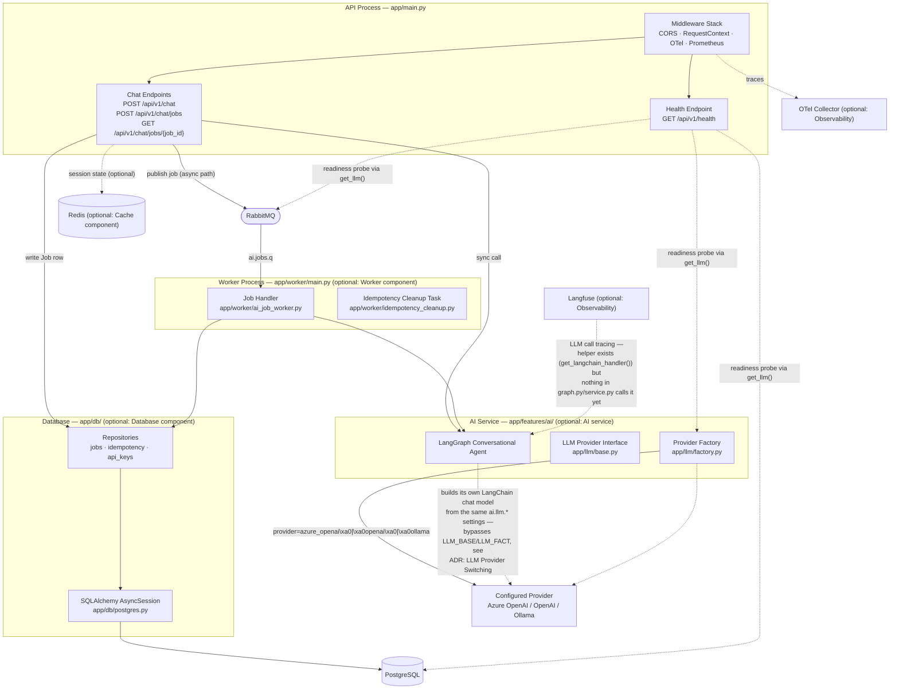
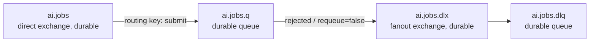
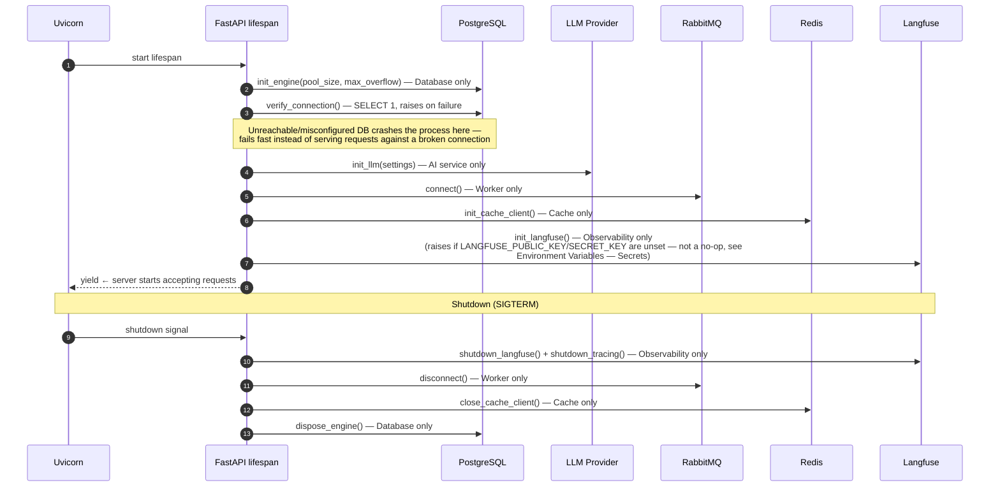

# Component Overview

How the API process, the worker process, and the surrounding infrastructure fit
together.

!!! note "Optional components"
    Database, Worker, Cache, and Observability are all independently togglable
    components (see `copier.yml`). The diagram below shows the **full** template —
    a given generated project only contains the boxes for the components it selected.
    The Worker process and everything downstream of RabbitMQ only exists when the
    Worker component is included, which itself requires the Database component.

---

## High-Level Component Map



---

## Dependency Injection Pattern

All cross-cutting concerns are `Annotated` type aliases in `app/core/dependencies.py`.
Endpoints declare them as function parameters — no direct instantiation of
infrastructure in handlers.

```python
# How it looks in an endpoint
async def chat(
    request: ChatRequest,
    llm: LLMDep,             # configured LLM provider singleton
    session: SessionDep,     # SQLAlchemy AsyncSession, if Database is included
) -> ChatResponse: ...
```

| Alias | Provides | Requires |
|---|---|---|
| `SettingsDep` | `Settings` singleton (env + `config.yaml`) | always |
| `SessionDep` | SQLAlchemy `AsyncSession` (per-request) | Database |
| `ApiKeyRepoDep` | `ApiKeyRepository` | Database + Auth |
| `LLMDep` | `LLMProvider` singleton (the AI service's configured provider) | AI service |
| `CacheDep` | Redis `CacheClient` singleton | Cache |

---

## RabbitMQ Topology

Requires the Worker component. One exchange/queue family for the AI service's async
job type — see [Failure Paths](../flows/failure-paths.md) for the retry/dead-letter
behavior.



To add a second job type, declare a second exchange + queue + DLX + DLQ pair
(`app/infrastructure/rabbitmq.py`'s own comment recommends this) rather than
overloading the single `ai.jobs.q` queue with multiple message shapes.

---

## Application Startup Sequence

Order matters: each step in `app/main.py`'s `lifespan()` depends on the ones before
it, and if any step raises, the remaining steps are skipped and the process never
starts accepting requests.



The unified worker entry point (`app/worker/main.py`, run via
`uv run python -m app.worker.main`) follows the same connect-then-verify order —
`init_engine()` + `verify_connection()` before it declares any RabbitMQ topology or
starts consuming — so a broken database exits the worker before it ever touches the
queue.

---

## Module Ownership

| Module | Responsibility |
|---|---|
| `app/core/` | Auth, config, middleware, DI wiring, observability |
| `app/api/v1/endpoints/` | HTTP layer only — validation, delegation to features |
| `app/features/` | Business logic (the AI service's conversational agent) |
| `app/worker/` | Consumer loop, job dispatch, background cleanup tasks |
| `app/db/` | PostgreSQL access — SQLAlchemy ORM models + repositories |
| `app/infrastructure/` | External service clients (RabbitMQ, Redis) |
| `app/llm/` | LLM provider abstraction (config, factory, provider implementations) |
| `evals/` | LLM-as-judge scoring harness for the AI service's output quality — not part of the pytest suite |
