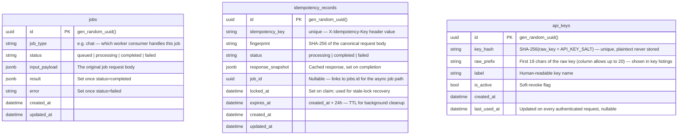

# Data Model

PostgreSQL tables, managed by Alembic migrations. Requires the Database component;
`api_keys` additionally requires the Auth service.

---

## Entity Relationship

No foreign key connects these three tables to each other — `idempotency_records.job_id`
is an unenforced reference (no `ForeignKey` constraint) used only to correlate a claim
with the job it produced, since the idempotency claim is written before the job row in
the request flow.

---

## `jobs`

One table for every "submit now, process later" job type — distinguished by
`job_type` rather than a table per capability. The AI service's async chat path is
the only job type this template ships (`job_type="chat"`); a new async capability
adds a new `job_type` value, not a new table.

| Column | Type | Nullable | Description |
|---|---|---|---|
| `id` | `UUID` | No | Primary key, server-default `gen_random_uuid()` |
| `job_type` | `String` | No | Which worker consumer handles this job, e.g. `chat`. Indexed |
| `status` | `String` | No | `queued` \| `processing` \| `completed` \| `failed`. Indexed |
| `input_payload` | `JSONB` | No | The original request body that created the job |
| `result` | `JSONB` | Yes | Set by the worker once processing succeeds |
| `error` | `String` | Yes | Set by the worker once processing fails |
| `created_at` / `updated_at` | `timestamptz` | No | Standard timestamp mixin |

!!! note "If a job type outgrows this table"
    The model's own docstring is explicit about this: if a job type accumulates enough
    bespoke columns to need its own shape, that's the signal to split it into a
    dedicated table — not to keep adding nullable columns here.

---

## `idempotency_records`

Backs the three-phase claim/complete/fail protocol used by the async chat-job submit
endpoint (`X-Idempotency-Key`). See
[ADR: Idempotency](../decisions/idempotency.md) for the full rationale and
[Failure Paths](../flows/failure-paths.md) for the request-time sequence.

| Column | Type | Nullable | Description |
|---|---|---|---|
| `id` | `UUID` | No | Primary key, server-default `gen_random_uuid()` |
| `idempotency_key` | `String` | No | The client-supplied `X-Idempotency-Key` value. Unique, indexed |
| `fingerprint` | `String` | Yes | `SHA-256` of the canonical (sorted-key) JSON request body |
| `status` | `String` | No | `processing` \| `completed` \| `failed` |
| `response_snapshot` | `JSONB` | Yes | The cached response body, written on `complete()` |
| `job_id` | `UUID` | Yes | The `jobs.id` this claim produced, if any (no FK constraint) |
| `locked_at` | `timestamptz` | Yes | Set when a claim moves to `processing`; a claim older than 5 minutes can be stolen by a new request (crash recovery) |
| `expires_at` | `timestamptz` | No | `created_at + 24h` by default; read by the background cleanup task |
| `created_at` / `updated_at` | `timestamptz` | No | Standard timestamp mixin |

---

## `api_keys`

Backs `X-API-Key` authentication. Requires the Auth service (which itself requires
Database). See [Auth Flow](../flows/auth-flow.md) for the per-request validation
sequence.

| Column | Type | Nullable | Description |
|---|---|---|---|
| `id` | `UUID` | No | Primary key, server-default `gen_random_uuid()` |
| `key_hash` | `String` | No | `SHA-256(raw_key + API_KEY_SALT)`. Unique, indexed. Plaintext is never persisted |
| `raw_prefix` | `String(20)` | No | `scripts/manage_api_keys.py` stores the first 19 characters of the raw key here (the column itself allows up to 20), for display in `list`/`deactivate`/`delete` output |
| `label` | `String` | No | Human-readable name for the key (e.g. which caller it belongs to) |
| `is_active` | `bool` | No | Soft-revoke flag — default `true` |
| `created_at` | `timestamptz` | No | Server-default `now()` |
| `last_used_at` | `timestamptz` | Yes | Updated on every successful authentication |

!!! note "No `updated_at` on `api_keys`"
    Unlike `jobs` and `idempotency_records`, `ApiKey` does not use the shared
    `TimestampMixin` — it declares `created_at` by hand and has no `updated_at` column
    at all. `is_active` and `last_used_at` are updated in place without a general-purpose
    audit timestamp.

---

## Postgres Indexes

| Table | Column(s) | Type | Purpose |
|---|---|---|---|
| `jobs` | `job_type` | regular | Filtering by which worker handles a job |
| `jobs` | `status` | regular | Status polling |
| `idempotency_records` | `idempotency_key` | unique | Atomic claim via `INSERT ... ON CONFLICT DO NOTHING` |
| `api_keys` | `key_hash` | unique | Fast auth lookup on every request |

---

## Data Lifecycle & Retention

| Data | Retention mechanism | Enforced by |
|---|---|---|
| `idempotency_records` | `expires_at` (created_at + `worker.idem_ttl_hours`, default 24h) | Background task in `app/worker/idempotency_cleanup.py`, running every `worker.idem_cleanup_interval_seconds` (default 3600s) |
| `jobs` | None | Rows persist indefinitely — add a retention job if job volume warrants it |
| `api_keys` | None (soft-revoke only) | `is_active=false` disables a key without deleting the row, preserving `last_used_at` history |
