# ADR: Idempotency — Three-Phase Claim/Complete/Fail Protocol

**Status:** Accepted

**Context:** `POST /api/v1/chat/jobs` — a client-facing submit endpoint where network
retries are expected and each submission triggers a queued LLM call.

---

## Problem

Any client that retries a timed-out or dropped request risks submitting the same
job twice. Two failure modes matter here, and they pull in opposite directions:

1. **Duplicate work** — a naive retry re-runs an expensive LLM call and creates a
   second `jobs` row for what was really one logical request.
2. **Cache poisoning** — a purely key-based dedup (no content check) means a client
   that reuses an idempotency key for a *different* request body silently gets back
   the wrong cached result instead of an error.

Both failure modes need to be closed at once, without introducing a distributed lock
or a second piece of infrastructure just for this.

## Decision

Separate **intent** from **content**, and use a single atomic Postgres insert as the
lock:

```mermaid
flowchart LR
    KEY["X-Idempotency-Key header<br/>(client-chosen, identifies one attempt)"]
    FP["SHA-256 of the request body<br/>(server-computed content fingerprint)"]
    CLAIM["Atomic claim in idempotency_records<br/>(key + fingerprint)"]
    KEY & FP --> CLAIM
```

**Idempotency key** — client-provided, identifies a specific submission attempt (a
UUID the client generates once per logical action, reused only on retry of that same
action).

**Fingerprint** — server-computed `SHA-256(canonical JSON body)`, sorted-key so field
ordering never changes the hash. Detects the case where a key is reused for a
genuinely different request.

### Three Phases

1. **Claim** — `INSERT INTO idempotency_records (idempotency_key, fingerprint,
   status='processing') ON CONFLICT DO NOTHING RETURNING id`. An empty `RETURNING`
   means the key already exists; inspect its `status`/`fingerprint` to decide what to
   do next (return cached result, reject as a conflict, or steal a stale lock — see
   [Failure Paths — Phase 1](../flows/failure-paths.md#phase-1-claim) for every
   branch).
2. **Resolve** — on success, `UPDATE ... SET status='completed',
   response_snapshot=result`; on failure, `UPDATE ... SET status='failed'`, which
   releases the claim so a subsequent retry starts fresh instead of being stuck
   behind a dead `processing` row.
3. **Recover** — a `locked_at` timestamp plus a 5-minute window lets any new request
   atomically steal a claim abandoned by a crashed process, using the same
   `UPDATE ... WHERE status='processing' AND locked_at=<old value>`
   optimistic-concurrency pattern the claim itself uses, so two concurrent stealers
   can't both win.

See [Failure Paths — Idempotency Claim/Complete/Fail Protocol](../flows/failure-paths.md#idempotency-claimcompletefail-protocol)
for the full flowchart and every branch, and
[Data Model — idempotency_records](../architecture/data-model.md#idempotency_records)
for the table shape.

### Why Postgres, Not Redis

The same database already stores `jobs` and (if Auth is included) `api_keys` —
adding Redis purely for this would be a second piece of infrastructure to run,
monitor, and back up for a marginal latency gain. The `UNIQUE` constraint on
`idempotency_records.idempotency_key` provides the atomic claim directly;
`INSERT ... ON CONFLICT DO NOTHING RETURNING id` with an empty result *is* the
"already exists" signal — no separate existence check needed.

!!! warning "Do not insert-and-catch `IntegrityError` instead"
    A request-scoped session that's already inside `async with session.begin()`
    (the pattern `app/db/postgres.py::get_session` uses) gets poisoned by a failing
    flush — the `rollback()` needed to recover from an `IntegrityError` closes the
    context-managed transaction, and every statement after it (including the
    cache-hit `SELECT` you'd want to run next) raises `InvalidRequestError: Can't
    operate on closed transaction inside context manager`. That turns every duplicate
    submission into a `500` instead of a clean cache hit or `409`. Letting Postgres
    silently absorb the conflict via `ON CONFLICT DO NOTHING` keeps the outer
    transaction usable for whatever comes next.

---

## Trade-offs

| Approach | Pros | Cons | Decision |
|---|---|---|---|
| No idempotency | Simplest | Duplicate LLM calls and job rows on every client retry | Rejected |
| Key-only (no fingerprint) | Simpler | Key reuse with a different body silently returns the wrong cached result | Rejected |
| Key + fingerprint, Postgres-backed (chosen) | Closes both failure modes; no new infrastructure; reuses the transaction the request is already in | One extra table, one extra write per submission | **Accepted** |
| Redis-backed | Faster reads | A second datastore to operate, back up, and keep consistent with Postgres, for a latency gain this endpoint doesn't need | Rejected |

---

## Consequences

- Every idempotent endpoint needs exactly one new column set on
  `idempotency_records` conceptually reused — no per-endpoint table.
- A client that wants a fresh attempt after a genuine failure retries with the
  **same** key (the `RETRY` branch resets `status='processing'`); a client that wants
  to change the request body must use a **new** key, or gets a `409`.
- The claim/resolve split means a crash between claim and resolve leaves a
  `processing` row — closed by the stale-lock recovery window, not by a manual
  cleanup step.
- `app/worker/idempotency_cleanup.py` still needs to run on an interval to actually
  delete expired rows — the TTL (`expires_at`) is a marker, not automatic garbage
  collection.

## Implementation

- `app/db/models/idempotency.py` — `IdempotencyRecord` ORM model
  (`idempotency_records` table)
- `app/db/repositories/idempotency.py` — `IdempotencyRepository.claim()`,
  `.complete()`, `.fail()`, `.poll_for_completion()`, `.delete_expired()`
- `app/worker/idempotency_cleanup.py` — background TTL cleanup loop
