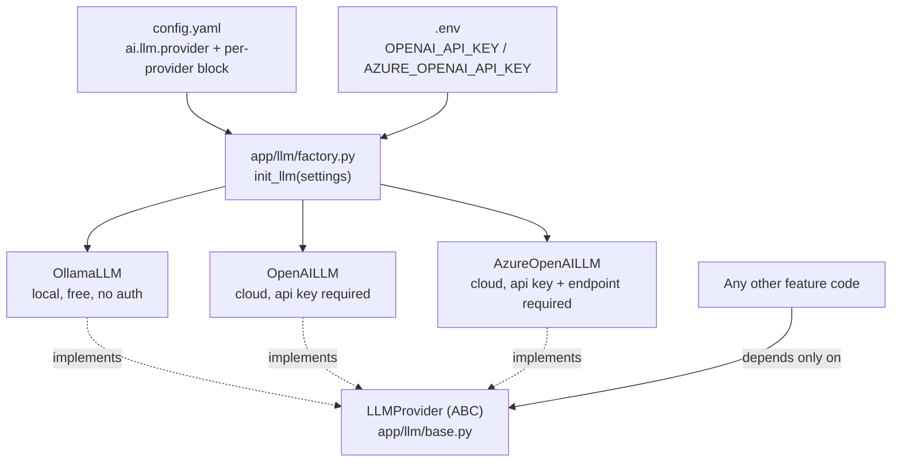

# ADR: LLM Provider Switching — Config-Only, Zero Code Changes

**Status:** Accepted

**Context:** No vendor lock-in for the AI service's LLM calls — free local iteration
during development, and a provider swap in production that never touches application
code.

---

## Problem

Hardcoding a single LLM vendor into feature code creates several problems at once:

- Every local iteration cycle costs money and needs cloud credentials, even for a
  one-line prompt tweak.
- Testing has to either hit a real endpoint (slow, flaky, costs money) or mock a
  vendor-specific SDK shape throughout the codebase.
- Switching vendors later — for cost, latency, or capability reasons — means hunting
  down every call site instead of flipping one setting.

## Decision

Every call into an LLM goes through one interface, `LLMProvider` (`app/llm/base.py`),
which feature code depends on rather than a provider SDK directly:

```
app/llm/
├── base.py       # LLMProvider ABC — the only thing feature code imports
├── config.py     # LLMSettings: provider selector + one config block per provider
├── factory.py    # init_llm(settings) → concrete provider instance, get_llm() singleton accessor
└── providers/
    ├── ollama.py
    ├── openai.py
    └── azure_openai.py
```



`init_llm_provider()` is a pure factory — given an `LLMSettings` block and the app's
`Settings` (for secrets), it returns a concrete provider instance with no
side effects. `init_llm()` wraps it to populate a process-wide singleton at startup;
`get_llm()` (used by `LLMDep` and the worker) returns that singleton or raises if
startup never ran. Switching providers is a `config.yaml` edit (or an
`AI__LLM__PROVIDER` env override) plus the matching secret in `.env` — no code
change, no redeploy of a different image.

!!! note "One deliberate exception: the LangGraph agent talks to a provider SDK directly"
    `app/features/ai/graph.py` does **not** go through `LLMProvider` — its own module
    docstring says so explicitly. `LLMProvider.complete()` takes plain role/content
    dicts and returns `str | BaseModel`, but LangGraph's prebuilt tool-calling nodes
    (`ToolNode`, `tools_condition`) need LangChain-native message and tool-call
    objects. Rather than hand-roll a tool-calling loop on top of `LLMProvider`,
    `graph.py::_build_chat_model()` mirrors the exact same provider `match` statement
    as `init_llm_provider()` — same `ai.llm.provider` switch, same secrets, same
    `timeout_s`/`max_tokens`/`temperature` — but constructs a LangChain chat model
    (`AzureChatOpenAI`/`ChatOpenAI`) instead of an `LLMProvider` instance. Provider
    switching still works identically for the agent (same config, same env override),
    it just isn't routed through the shared interface. A second agent framework with
    the same requirement should follow this same pattern — mirror the switch, don't
    force `LLMProvider` to also satisfy a shape it wasn't designed for.

### Provider Configurations

=== "Azure OpenAI (production default)"
    **`config.yaml`:**
    ```yaml
    ai:
      llm:
        provider: "azure_openai"
        azure_openai:
          endpoint: "https://<resource>.openai.azure.com/"
          deployment: "gpt-4o"
          api_version: "2024-02-01"
    ```
    **`.env`:**
    ```dotenv
    AZURE_OPENAI_API_KEY=<key>
    ```

=== "OpenAI"
    **`config.yaml`:**
    ```yaml
    ai:
      llm:
        provider: "openai"
        openai:
          base_url: "https://api.openai.com/v1"
          model: "gpt-4o"
    ```
    **`.env`:**
    ```dotenv
    OPENAI_API_KEY=sk-...
    ```

=== "Ollama (local, free)"
    ```bash
    ollama pull llama3.1
    ollama serve
    ```
    **`config.yaml`:**
    ```yaml
    ai:
      llm:
        provider: "ollama"
        ollama:
          base_url: "http://localhost:11434/v1"
          model: "llama3.1"
    ```
    No secret required — Ollama is a local, unauthenticated server.

`init_llm_provider()` (`app/llm/factory.py`) raises `ValueError` at startup — not at
first use — if the selected provider's required secret or config field is missing
(e.g. `azure_openai` selected but `AZURE_OPENAI_API_KEY` is empty, or
`ai.llm.azure_openai.endpoint` is unset). A misconfigured provider fails fast during
the API/worker startup sequence rather than surfacing as a confusing error on the
first real request.

---

## Trade-offs

| Option | Pros | Cons |
|---|---|---|
| Hardcode one vendor | Simple | Breaks free local dev, vendor lock-in, hard to test |
| Provider abstraction, one interface (chosen) | Free local iteration (Ollama), swap providers with a config change, easy to mock in tests | One more layer of indirection than calling a vendor SDK directly |
| Env-vars-only, no factory/interface | Even simpler | Breaks the moment a provider needs custom logic — Azure OpenAI's endpoint/deployment/api-version triplet doesn't map to a single "base URL" the way OpenAI-compatible servers do |

The abstraction earns its keep specifically because Azure OpenAI is not a drop-in
OpenAI-compatible endpoint — it needs an `endpoint` + `deployment` + `api_version`
triplet, not a single `base_url`, which a bare environment-variable swap can't
express cleanly.

---

## Where This Matters

- **Local development** — use Ollama for free, offline iteration on prompts and agent
  logic.
- **Testing** — mock `LLMProvider.complete()` directly in `conftest.py`; no
  provider-specific mocking needed anywhere else.
- **CI** — tests never call a real LLM endpoint.
- **Production** — Azure OpenAI or OpenAI, chosen for quality/latency/compliance,
  swapped in without touching `app/features/ai/`.
- **New provider** — a new `providers/<name>.py` implementing `LLMProvider`, a new
  config block on `LLMSettings`, a new `match` case in `init_llm_provider()`, **and**
  a matching `match` case in `app/features/ai/graph.py::_build_chat_model()` if the
  AI service should be able to use it too (that switch isn't shared code — see the
  note above). No new ADR needed for a provider addition — this document covers the
  pattern, not any single provider's presence.
