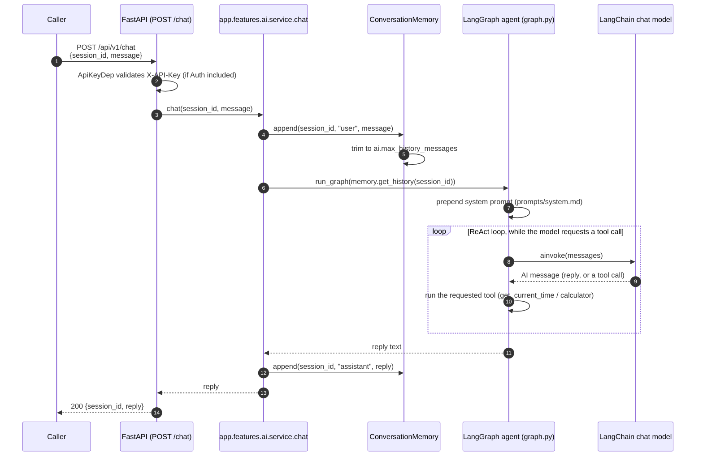
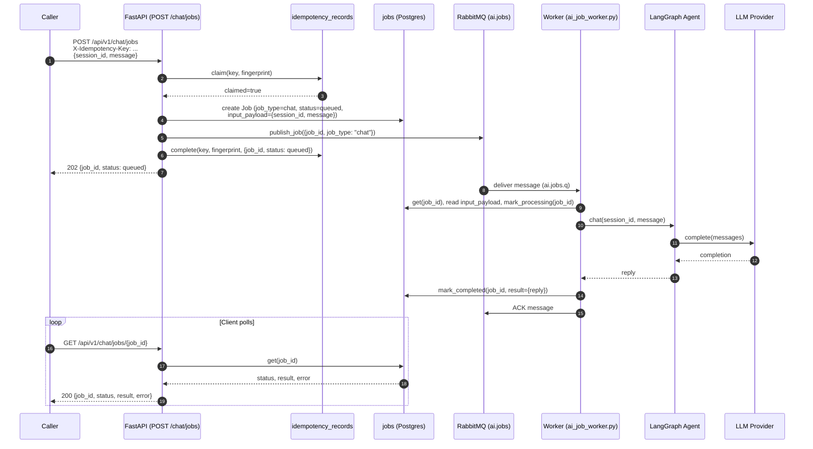

# AI Service Flows

The AI service exposes the same conversational agent two ways: a synchronous call
that blocks for the reply, and an async submit-then-poll path for slower requests.
Both require the AI service; the async path additionally requires the Worker
component.

---

## Synchronous Chat

`POST /api/v1/chat` — the caller waits for the agent's reply in the same
request/response cycle. Good for short, low-latency turns.

`app/features/ai/service.py::chat()` is the single entry point both this endpoint
and the async worker call — there is exactly one code path that talks to the agent.
`ConversationMemory` is a process-local, in-memory store keyed by `session_id`
(lost on restart — swap in a persistent/shared store, e.g. via the Cache component,
before running more than one API replica). The two example tools
(`get_current_time`, `calculator`, in `app/features/ai/tools/example_tools.py`) exist
to prove the tool-calling loop works end to end — replace or extend them with the
generated project's real tools.

!!! note "The agent talks to a LangChain chat model directly, not `LLMProvider`"
    `graph.py` is a deliberate, documented exception to
    [ADR: LLM Provider Switching](../decisions/llm-provider-switching.md) — it needs
    LangChain-native message/tool-call objects for `ToolNode`/`tools_condition`,
    which `LLMProvider.complete()` doesn't produce. It mirrors the same
    `ai.llm.provider` switch and the same settings (`temperature`, `timeout_s`,
    `max_tokens`), so config-only provider switching still works for the agent — see
    the ADR for the full rationale.

See [API Endpoints Overview](../api/overview.md#post-apiv1chat) for the exact
request/response shape.

---

## Async Chat Job

`POST /api/v1/chat/jobs` + `GET /api/v1/chat/jobs/{job_id}` — the same agent call,
queued for the worker instead of blocking the request. Requires `X-Idempotency-Key`
on submit; see [Failure Paths](failure-paths.md#idempotency-claimcompletefail-protocol)
for what that buys.

Two details that are easy to miss:

- **The idempotency claim is resolved at submit time, not at job-completion time.**
  `complete(key, fingerprint, {job_id, status: "queued"})` runs synchronously inside
  `submit_chat_job`, right after publishing — the "protected work" the idempotency
  layer guards is *enqueueing the job*, not running it. A replayed submission always
  gets back `status: "queued"`, regardless of the job's real current state; poll
  `GET /chat/jobs/{job_id}` for that. See
  [ADR: Idempotency — Phase 2](../decisions/idempotency.md) and
  [Failure Paths](failure-paths.md#idempotency-claimcompletefail-protocol).
- **The RabbitMQ message carries only `job_id` — never `job_type`,
  `session_id`, or `message`.** `app/worker/main.py::_handle_message` loads the
  `Job` row from Postgres by `job_id` *first*, then dispatches on the row's own
  `job_type` column — not on anything in the queue message itself. This is
  deliberate: the message is just a pointer, so a job's dispatch key and its
  actual payload live in exactly one place (Postgres), not duplicated between
  the message envelope and the row. `session_id`/`message` are read the same
  way, from `Job.input_payload`, after that lookup. If the agent call raises,
  the worker calls `mark_failed(job_id, error)` on the `jobs` row; it does not
  touch `idempotency_records` at all (that claim already resolved to
  `completed` before the job ever ran).
- **An unknown `job_type` is logged and the message is dropped, not
  dead-lettered.** If `Job.job_type` doesn't match any handler the worker
  knows about, `_handle_message` logs `worker.job.unknown_type` and returns —
  since `message.process()` only rejects a message when the handler raises,
  this is an ack, not a requeue/dead-letter. In practice this should only ever
  happen if a *different* job type gets published to this same queue without a
  matching handler being added here — see
  [Failure Paths](failure-paths.md#dead-letter-behavior-aijobs-aijobsdlq).
- **A session's conversation memory isn't shared between the API and worker
  processes.** `ConversationMemory` (see [Synchronous Chat](#synchronous-chat) above)
  is a module-level, in-process dict — the API process and the worker process each
  hold their own, independent instance. A `session_id` built up through
  `POST /chat` calls has no history when the *same* `session_id` is later used in a
  `POST /chat/jobs` call handled by the worker, and vice versa. Fine for a
  single-process demo; a generated project that mixes the sync and async paths for
  the same session needs a shared store (Postgres or Redis, per `memory.py`'s own
  docstring) before this is safe to rely on.

!!! note "One message shape, one job type"
    `app/worker/main.py` dispatches on `payload["job_type"]`; `"chat"` is the only
    value this template ships. A second AI capability that needs its own async path
    adds a new `job_type` branch and its own handler module (e.g.
    `app/worker/summarize_job_worker.py`), not a new queue — see
    [Component Overview — RabbitMQ Topology](../architecture/component-overview.md#rabbitmq-topology).
