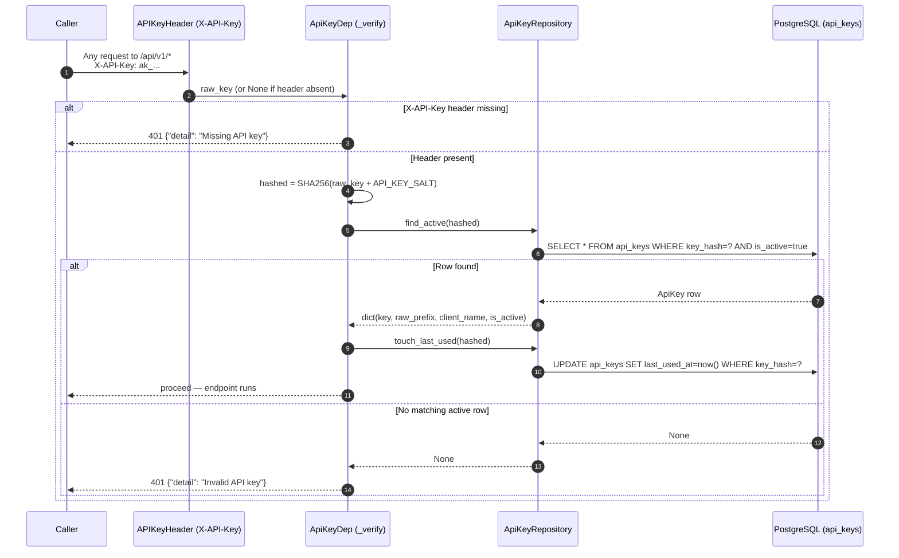
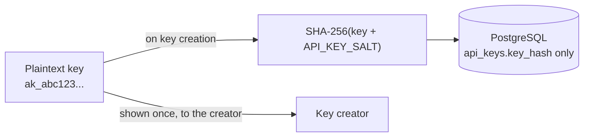

# Auth Flow

`X-API-Key` header authentication for every endpoint except `GET /api/v1/health` and
`GET /metrics`. Requires the Auth service (which itself requires Database).

---

## Key Format

```
ak_<64 lowercase hex characters>
```

Only the hash is ever persisted — `SHA-256(raw_key + API_KEY_SALT)` — in the
`api_keys.key_hash` column. The raw key is never stored and, once issued, cannot be
recovered; losing it means generating a new one. See
[Data Model — api_keys](../architecture/data-model.md#api_keys) for the table shape.

---

## Per-Request Validation Sequence



`app/core/auth.py::_verify` logs only the first 8 characters of a failed raw key
(`auth.invalid_key`, `prefix=raw_key[:8]`) — never the full value — to keep secrets
out of log output even on a failed attempt.

---

## Key Storage Security



`API_KEY_SALT` is a server-side secret (see
[Environment Variables — Secrets](../operations/environment-variables.md#secrets-env)).
Even if the `api_keys` table is exfiltrated, an attacker cannot reverse the hashes
without the salt.

---

## Exempt Endpoints

| Endpoint | Auth required | Reason |
|---|---|---|
| `GET /api/v1/health` | No | Infrastructure health/liveness probes |
| `GET /metrics` | No | Prometheus scrapes from inside the deployment network |
| Every other endpoint | **Yes** | Product API — requires `X-API-Key` |

---

## Issuing and Revoking Keys

`scripts/manage_api_keys.py` wraps `hash_with_salt()` and talks to Postgres
directly (via `DATABASE_URL`/`API_KEY_SALT` from `.env`) — it needs the API process
running to define its models' import path, but not running as a server:

```bash
uv run python scripts/manage_api_keys.py create --label "local-dev"
```

```
Created key for 'local-dev' (prefix ak_a3f7c2d1e4b8abc).
RAW KEY — save this now, it will never be shown again:

  ak_a3f7c2d1e4b8abcdef0123456789abcdef0123456789abcdef0123456789ab
```

The raw key is generated as `ak_` + 32 random bytes hex-encoded (67 characters
total); only `raw_prefix` (the first **19** characters — enough to identify a key in
a listing without revealing it) and `key_hash = SHA256(raw_key + API_KEY_SALT)` are
persisted. Other subcommands:

```bash
uv run python scripts/manage_api_keys.py list                    # prefix, label, active?, last used
uv run python scripts/manage_api_keys.py deactivate <prefix>      # soft-revoke
uv run python scripts/manage_api_keys.py reactivate <prefix>
uv run python scripts/manage_api_keys.py delete <prefix>          # hard delete
```

`deactivate`/`reactivate` flip `is_active` in place — no restart required, there is
no in-process cache, so the change takes effect on the very next request.
