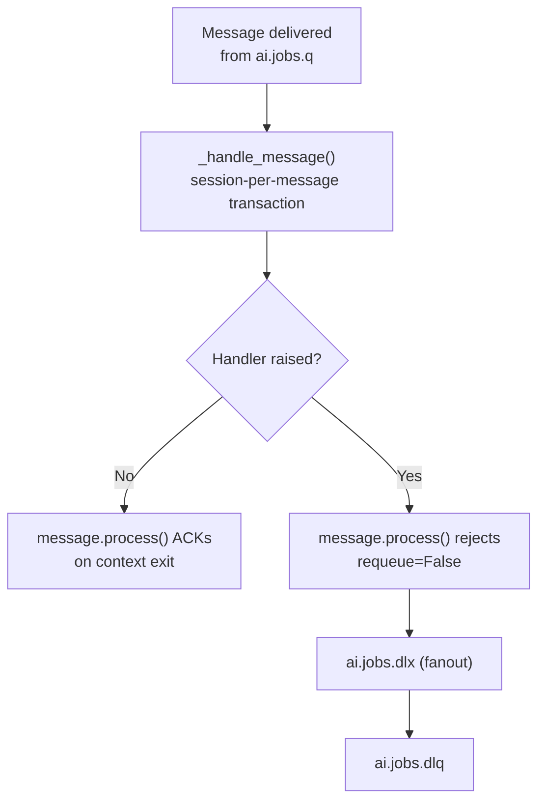
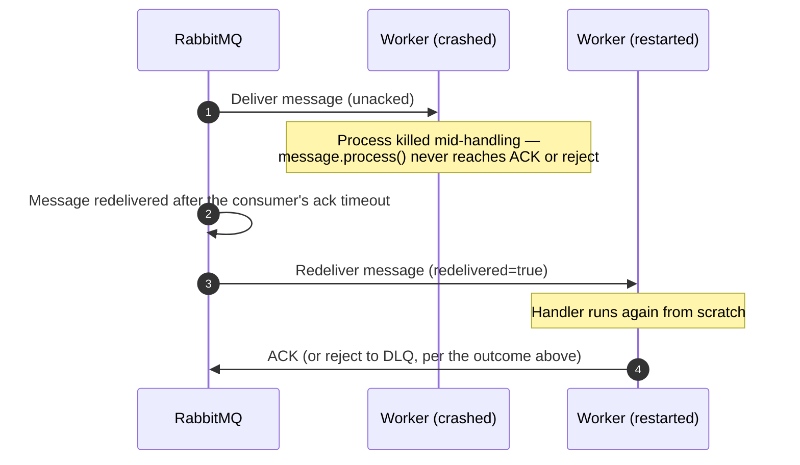
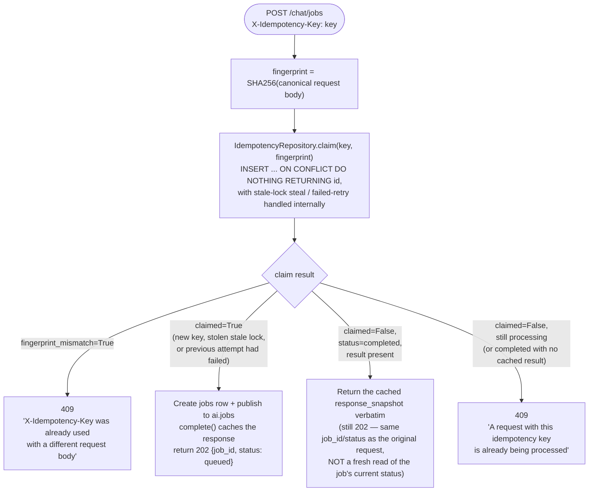

# Failure Paths

How the AI service's async job queue and the idempotency layer behave when
something goes wrong. Both require the Worker component; idempotency additionally
requires the AI service (the only endpoint that takes `X-Idempotency-Key`).

---

## Dead-Letter Behavior — `ai.jobs` → `ai.jobs.dlq`

!!! note "An unrecognized job_type acks, it does not dead-letter"
    `_handle_message` loads the `Job` row from Postgres and dispatches on its
    `job_type` column (see [AI Service Flows](ai-service.md)). If `job_type`
    doesn't match any handler registered here, it logs `worker.job.unknown_type`
    and returns **without raising** — so `message.process()` ACKs it rather than
    routing it to the DLQ. This only matters once a *second* job type is added
    to this queue without a matching branch in `_handle_message`; today, with
    only `"chat"` ever published, it's unreachable in practice. If you add a new
    job type, either add its handler at the same time or raise instead of
    logging-and-returning so a missing handler dead-letters loudly instead of
    silently acking.

`app/worker/main.py::_handle_message` wraps every message in
`message.process(requeue=False)`. That context manager ACKs the message if the
handler returns normally, and — the moment the handler raises — rejects it with
`requeue=False`. Because `ai.jobs.q` is declared with
`x-dead-letter-exchange: ai.jobs.dlx`, a rejected-not-requeued message is routed to
the fanout `ai.jobs.dlx` and lands in `ai.jobs.dlq`, not back on `ai.jobs.q`.

!!! warning "No retry, and no automated dead-letter consumer"
    Unlike a system with a retry counter and a bounded number of re-publish attempts,
    this template's worker does **exactly one** attempt per message — any exception
    sends the message straight to `ai.jobs.dlq`. There is no consumer registered on
    `ai.jobs.dlq` out of the box: dead-lettered messages accumulate there until an
    operator inspects and redrives them. `scripts/redrive_dlq.py` does exactly
    that — `uv run python scripts/redrive_dlq.py [--limit N] [--dry-run]` republishes
    each dead-lettered message back onto `ai.jobs` and ACKs it off the DLQ — but it's
    a manual, operator-run tool, not an automated consumer. A generated project with
    meaningful failure volume should add both a retry counter (re-publish with an
    incremented count, up to `worker.max_retries`, before giving up to the DLQ) and
    an automated dead-letter consumer that marks the corresponding `jobs` row
    `failed` — see [ADR: Idempotency](../decisions/idempotency.md) for the same
    "fail explicitly, don't leave things ambiguous" principle applied to the
    idempotency layer.

### Worker Crash vs. Handled Failure

A handler raising an exception (rejected to the DLQ, above) is a different case from
the **worker process itself** crashing mid-message:

A crash never loses the message — RabbitMQ redelivers it once a new consumer is
available. Whether that redelivery is safe to simply reprocess depends on the
handler's own idempotency: `handle_chat_job` should write results keyed by `job_id`
using `INSERT ... ON CONFLICT` / `UPDATE ... WHERE status=...` patterns (the same
principle the idempotency layer below uses), not blind inserts, so a redelivered
message never double-processes.

---

## Idempotency Claim/Complete/Fail Protocol

Backs `X-Idempotency-Key` on `POST /api/v1/chat/jobs`. Full rationale in
[ADR: Idempotency](../decisions/idempotency.md); table shape in
[Data Model — idempotency_records](../architecture/data-model.md#idempotency_records).

### Phase 1 — Claim

The atomic claim is `INSERT ... ON CONFLICT DO NOTHING RETURNING id` — not
insert-and-catch-`IntegrityError`. The request-scoped session runs inside
`async with session.begin()`; a failed flush would poison that transaction, and the
`rollback()` needed to recover closes the context-managed transaction, turning every
subsequent statement (including the cache-hit `SELECT`) into an
`InvalidRequestError`. Letting Postgres silently absorb the conflict avoids that
failure mode entirely.

!!! note "The 409 endpoint messages are plain strings, not `{error, detail}` objects"
    `app/api/v1/endpoints/chat.py`'s `submit_chat_job` raises
    `HTTPException(status_code=409, detail="...")` with a plain string — FastAPI's
    default error shape (`{"detail": "..."}`), not a structured error-code object.
    See [Error Catalog](../api/error-catalog.md#http-409-conflict) for both exact
    messages.

!!! warning "No block-and-wait for a concurrent duplicate — it gets a 409, not a 202"
    A second request arriving with the same `X-Idempotency-Key` while the first is
    still `processing` is rejected outright (`BUSY` branch above), not handed the
    original `job_id` and not made to block until the first resolves.
    `IdempotencyRepository.poll_for_completion()` exists as a primitive for an
    endpoint that *does* want to block-and-wait behind a concurrent duplicate, but
    `submit_chat_job` doesn't call it — the caller has to retry (with the same key,
    once the first attempt finishes) or poll `GET /chat/jobs/{job_id}` if it already
    has a `job_id` from a prior successful submission.

### Phase 2 — Resolve

After the worker finishes processing the job:

- **Success** → `complete(key, fingerprint, result)`: `UPDATE idempotency_records SET status='completed', response_snapshot=result WHERE idempotency_key=? AND fingerprint=? AND status='processing'`. Note that `submit_chat_job` calls this **immediately after publishing**, with `result={job_id, status: "queued"}` — completing the *idempotency claim*, not the *job*. A replayed request therefore always gets back `status: "queued"` from the cache hit, even if the underlying job has since finished — poll `GET /chat/jobs/{job_id}` for the live status.
- **Failure** — if the job itself later fails, the **worker** calls `job_repo.mark_failed()` on the `jobs` row, but does not call `idempotency_repo.fail()` — the idempotency claim was already resolved (`completed`) at submit time, before the job ran. `IdempotencyRepository.fail()` exists for an endpoint that resolves its idempotency claim only after the protected work finishes; `submit_chat_job`'s protected work is "enqueue the job," which either succeeds synchronously or raises before any claim is ever completed.

### Phase 3 — Stale-Lock Recovery

If the process crashes while a record is `status=processing`, the row would stay
locked forever without a recovery path. `locked_at` plus a 5-minute window
(`_STALE_LOCK_MINUTES`) lets any new request atomically steal an abandoned lock,
inside `claim()` itself, using the same
`UPDATE ... WHERE status='processing' AND locked_at=<old value>` optimistic-concurrency
pattern so two concurrent stealers can't both win. From the endpoint's point of view
this is indistinguishable from a brand-new claim — both come back as `claimed=True`.

### Background Cleanup

`app/worker/idempotency_cleanup.py` runs every `worker.idem_cleanup_interval_seconds`
(default 3600s), deleting every row where `expires_at < now()` — the TTL is
`worker.idem_ttl_hours` (default 24h) from claim time. Cancelled cleanly via
`asyncio.Task.cancel()` on worker shutdown.
